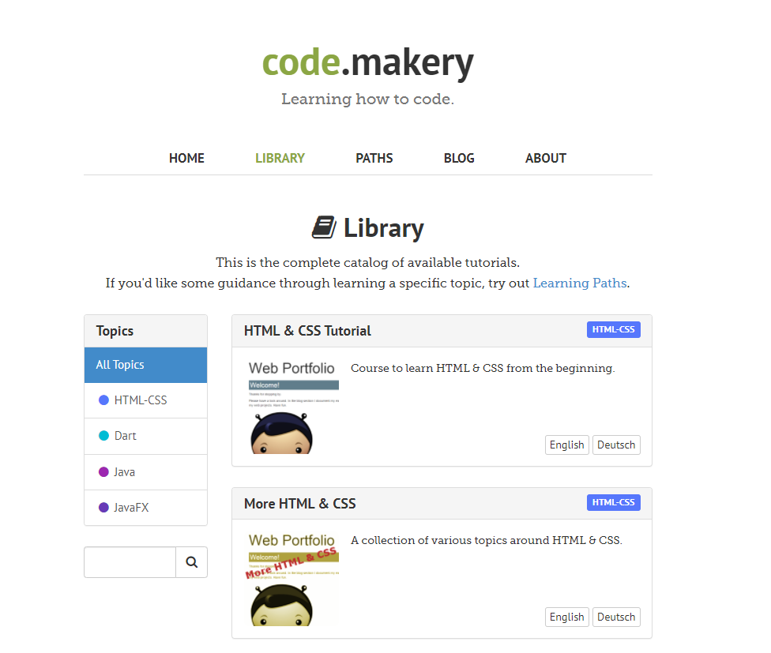
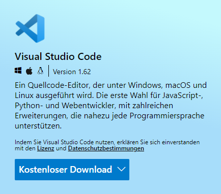

+++
title = "Calisthenics"
date = "2022-01-11"
draft = false
pinned = false
image = "img_20211219_141040_resized_20220111_021425118-1-.jpg"
+++
# BärnOutdoor

Ich schloss mich mit Dominic in ein Team. Wir haben auch eine weile nach einem Kunden umgesehen, aber leider haben wir nichts entsprechendes gefunden. Beispielsweise haben wir nach Coiffeur Salon umgesehen, aber die allermeisten hatten bereits einen Internetauftritt. 

Nach den Herbstferien haben Dominic und ich entschlossen, verschiedene Wege zu gehen, da wir unterschiedliche Interessen hatten. In den ersten Wochen nach den Herbstferien habe ich mich darüber informiert, wie man genau programmiert. Dieses Wissen habe ich vorwiegen aus den Kapiteln von der Website *code.makery.ch.*

Im November habe ich mich damit beschäftigt, auf Visual Studio auf eine einfache Art zu programmieren. Visual Studio ist ein eigenständiger Quellcode Editor von Microsoft.

Im Dezember habe ich mich mit  Bootstrap beschäftigt.