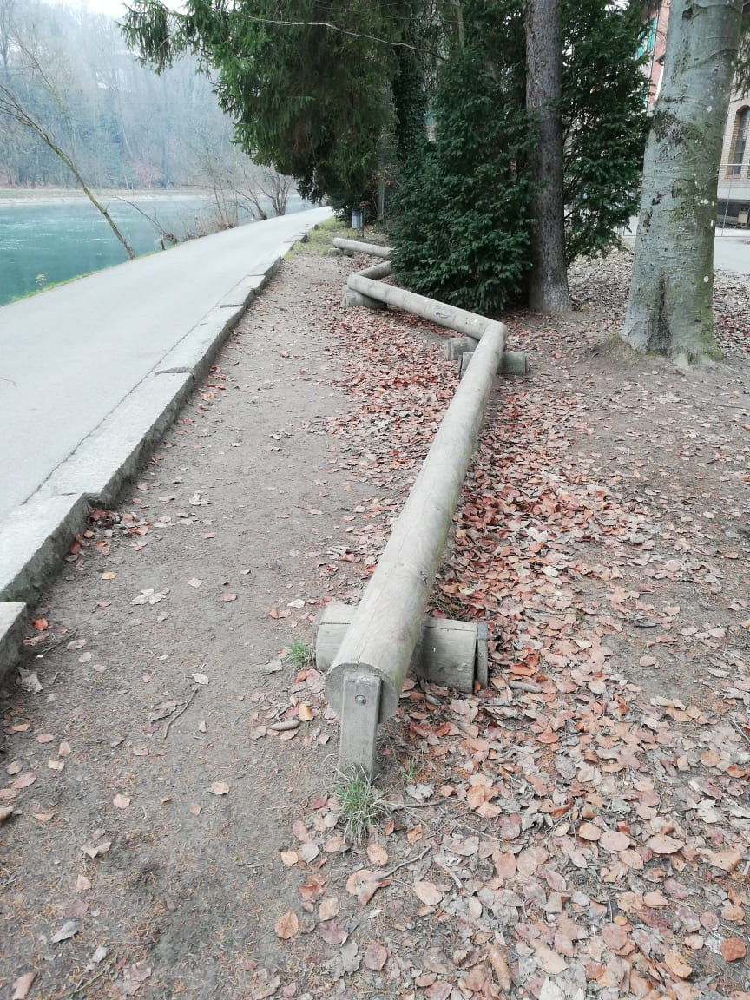
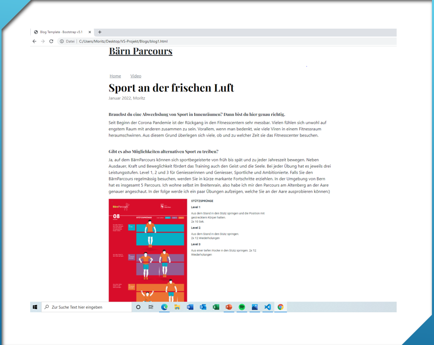
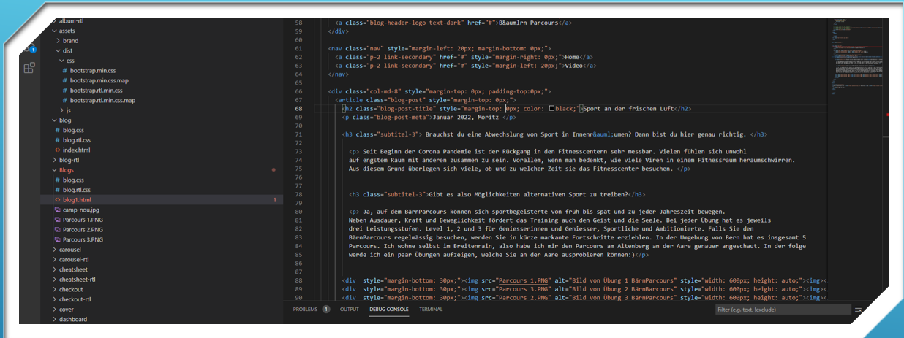

+++
title = "Projektrückblick WEB"
date = "2022-01-11"
draft = false
pinned = false
image = "img_20211219_141040_resized_20220111_021425118-1-.jpg"
+++
# BärnOutdoor

Ich schloss mich mit Dominic in ein Team. Wir haben uns auch eine Weile nach einem Kunden umgesehen, aber leider haben wir nichts passendes gefunden. Beispielsweise haben wir uns nach einem Coiffeur Salon umgesehen, aber die allermeisten hatten bereits einen Internetauftritt oder hatten zu hohe Erwartungen an uns. Dominic hatte sich auch bei einer Badi in Thun vorgestellt, aber auch sie hatten bereits einen Webauftritt. 

Nach den Herbstferien haben Dominic und ich entschlossen, verschiedene Wege zu gehen, da wir unterschiedliche Interessen hatten. In den ersten Wochen nach den Herbstferien habe ich mich darüber informiert, wie man genau programmiert. Dieses Wissen habe ich vorwiegend aus den Kapiteln von der Website *code.makery.ch.* Auch habe ich mich auf Foren und auf YouTube Videos darüber informiert, wie genau man eine Webseite programmiert.

Im November habe ich mich damit beschäftigt, auf Visual Studio auf eine einfache Art zu programmieren. Visual Studio ist ein eigenständiger Quellcode Editor von Microsoft.

Im Dezember habe ich mich mit Bootstrap beschäftigt. Bootstrap ist ein Framework. Das bedeutet, dass man sich auf CSS und HTML basierende Gestaltungsvorlagen herunterladen kann, damit man nicht selbst die ganze Programmierung machen muss. Ich habe mir Gedanken gemacht, welche Vorlage für mein Projekt am geeignetsten ist. Ist wollte eher eine einfache Vorlage für mein Projekt.

Vor den Weihnachtsferien ging ich an die Aare runter, um Fotos vom Parcours zu machen. Ich benötigte dafür etwa 2 Stunden und machte etwa 20 Bilder. Auf dem unteren Bild sieht man ein Parcours Gerät. 

Kurz nach den Weihnachtsferien habe ich damit begonnen, meine Webseite zu programmieren und fertig zu stellen. Mein Vater hat mir teilweise auch ein wenig geholfen, da er ein grosses Wissen über das Programmieren hat. Schliesslich konnte ich meine Webseite fertigstellen.

Ich konnte viele neue Erkenntnisse gewinnen, was das Programmieren angeht. Ich habe gelernt, wie man das HTML mit verschiedenen Tags strukturiert. Dazu gehören beispielsweise Margin, Border und Padding. Mit diesen Styles kann man das Element formatieren. Auch habe ich etwas über die Barrierefreiheit gelernt. Mit dem Ausdruck "barrierefrei" wird die uneingeschränkte Zugänglichkeit eines Produktes, einer Dienstleistung oder einer Einrichtung, unabhängig von einer möglichen Behinderung oder Erkrankung beschrieben. Im folgenden sehen Sie einen Ausschnitt aus meinen Visual Studio Code

